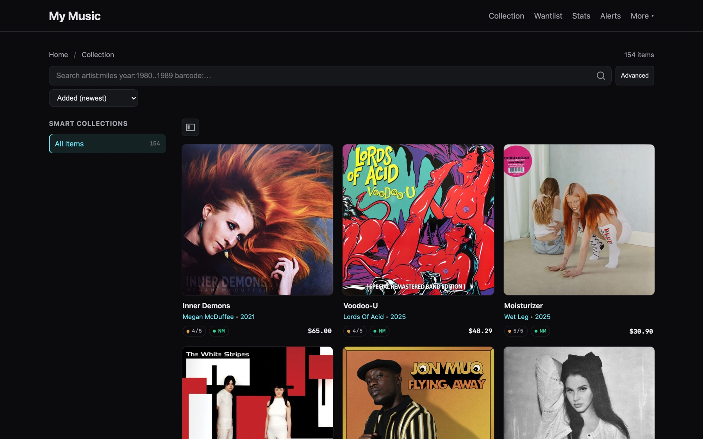
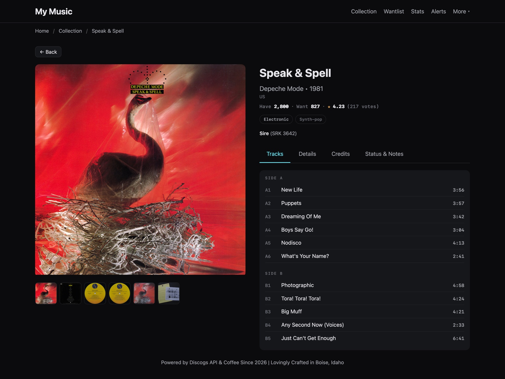
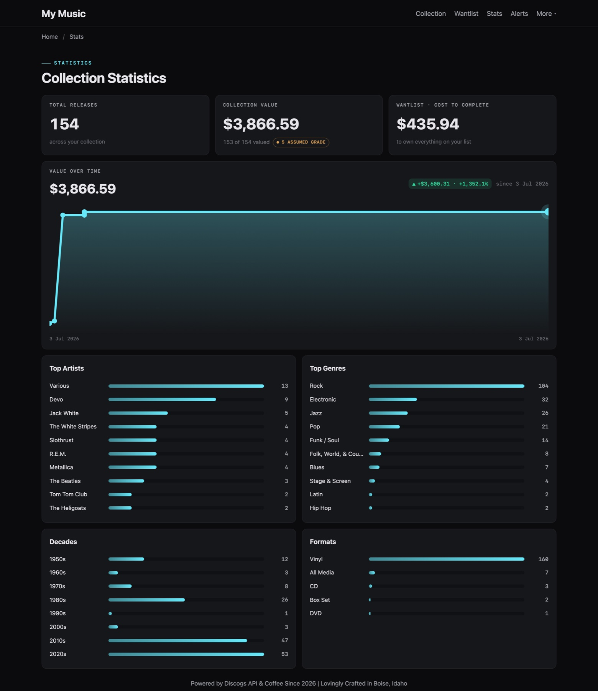
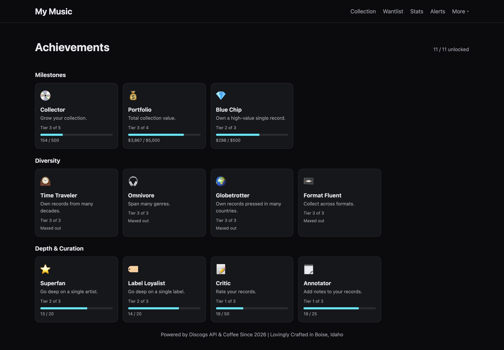
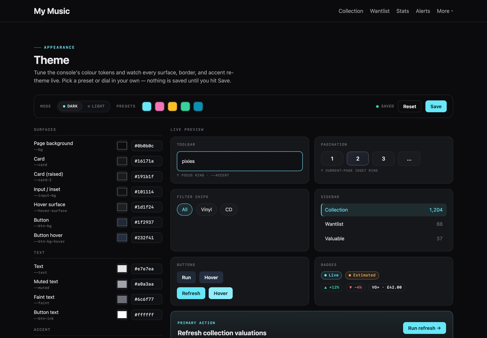

# My Music Collection (Discogs)

**Your Discogs collection, local‑first and lightning‑fast — browse, search, value, and theme it, entirely from your own machine.**

[](https://github.com/adamjohnlea/my-music-collection/actions/workflows/ci.yml)


Local‑first Discogs collection viewer written in PHP 8.4. Imports your collection into SQLite, caches cover images to disk, and serves a fast Twig UI with powerful full‑text search and optional release enrichment. All browsing is from your local DB + images — no live API calls while you use the app.



> **Personal use.** If you self‑host publicly, respect Discogs ToU: refresh ≤6h and show attribution (“Data provided by Discogs.” + link/trademark).

## Contents
- [Features](#features)
- [Screenshots](#screenshots)
- [Prerequisites](#prerequisites)
- [Quick start](#quick-start)
- [Web Console Interface](#web-console-interface)
- [Search](#search)
- [AI Recommendations](#ai-recommendations)
- [Apple Music Integration](#apple-music-integration)
- [Appearance & theming](#appearance--theming)
- [Collection poster](#collection-poster)
- [Sorting](#sorting)
- [Notes, ratings, and conditions](#notes-ratings-and-conditions)
- [Collection valuation](#collection-valuation)
- [Wantlist price-drop alerts](#wantlist-price-drop-alerts)
- [Achievements](#achievements)
- [Commands overview](#commands-overview)
- [Development](#development)
- [FAQ](#faq)
- [Troubleshooting](#troubleshooting)

## Features
- Local‑first: SQLite database + cached images (no API calls during normal browsing)
- Discogs‑aware HTTP client: header‑driven rate limiting + robust retries
- Initial sync and incremental refresh of your Collection and Wantlist
- Optional enrichment with full release details (tracklist, credits, companies, identifiers, notes, videos) and personal metadata (ratings, conditions, notes)
- Sync personal data: push your ratings, conditions, and notes back to Discogs or keep them locally
- Image cache with 1 req/sec throttle and 1000/day cap (persisted)
- Search anything (SQLite FTS5) with field prefixes and year ranges
- Sorting: Added date (default), Year, Artist, Title, Rating
- Clean, responsive UI with a lightbox gallery and sticky header
- Smart Collections: save your searches as sidebar shortcuts
- Statistics: visualization of your collection by artist, genre, decade, and format
- Randomizer: "Surprise Me" button to pick a random release from your collection
- Live Discogs Search: find and add releases directly to your collection or wantlist from the web UI
- AI-Powered Recommendations: get personalized recommendations for artists and releases based on what's in your collection (powered by Anthropic Claude)
- Collection Valuation: price every record at its actual condition using Discogs marketplace data, with value-over-time tracking and an insurance CSV export
- Wantlist Price-Drop Alerts: set target prices and get notified when items you're hunting drop in price
- Achievements: unlock gamified badges earned from your own collection
- Fully Themeable: a live theme editor with dark/light modes, presets, and per-token colour control
- Collection Poster: render a high-resolution cover-wall poster of your collection
- Static Site Generator: export your collection as a standalone, portable web app
- Apple Music Integration: listen to releases directly in the app (requires barcodes and an Apple Music Developer Token)

## Screenshots

|  |  |
| --- | --- |
| **Release detail** — tracklist, credits, gallery, Apple Music | **Collection statistics** — value over time, top artists & genres |
| [](docs/screenshots/release.jpg) | [](docs/screenshots/stats.jpg) |
| **Achievements** — gamified, tiered badges | **Theme editor** — live, token-level theming |
| [](docs/screenshots/achievements.jpg) | [](docs/screenshots/theme.jpg) |

## Prerequisites
- PHP 8.4 (Herd recommended)
- Composer
- A Discogs account with a personal access token.
  - To get a token: Go to [Discogs Developer Settings](https://www.discogs.com/settings/developers), click **"Generate new token"**, and copy the result.

## Quick start
1) Copy `.env.example` to `.env` and fill values (including your Discogs credentials):

```
USER_AGENT="MyDiscogsApp/0.1 (+contact: you@example.com)"
DB_PATH=var/app.db
IMG_DIR=public/images
APP_ENV=dev
APP_DEBUG=1

# Discogs Credentials
DISCOGS_USERNAME=your_username
DISCOGS_TOKEN=your_personal_access_token

# AI Recommendations (Optional)
ANTHROPIC_API_KEY=your_anthropic_api_key
```

2) Install dependencies
```
composer install
```

3) Run the web app
```
php -S 127.0.0.1:8000 -t public
```
Open http://127.0.0.1:8000/

4) Initial sync (creates DB and imports your collection and wantlist)

**Option A: Web Interface** (Recommended)
- Navigate to http://127.0.0.1:8000/tools
- Click "Run initial sync" and watch the progress in real-time

**Option B: Command Line**
```
php bin/console sync:initial
```
Important: If the database already contains data, `sync:initial` refuses to run unless you pass `--force`. For ongoing usage, prefer:
```
php bin/console sync:refresh
```
This preserves any enriched details and updates basic fields for both collection and wantlist incrementally.

5) Optional: enrich releases with full details
```
php bin/console sync:enrich --limit=100
# or a specific release
php bin/console sync:enrich --id=123456
```

6) Optional: download missing cover images (respects 1 rps, 1000/day)
```
php bin/console images:backfill --limit=200
```

7) Optional: incremental refresh (new/changed since last run)
```
php bin/console sync:refresh --pages=5
# override the since cursor
php bin/console sync:refresh --since=2024-01-01T00:00:00Z
```

8) Optional: rebuild search index (maintenance)
```
php bin/console search:rebuild
```

## Web Console Interface
All console commands can be run from a web-based interface with real-time progress indicators:

1. **Access**: Navigate to `/tools` or click "Tools" in the navigation menu
2. **Features**:
   - Execute all console commands from your browser
   - Real-time output streaming as commands run
   - Progress indicators showing status and line counts
   - Two-column responsive layout for easy access
   - No need to use the terminal

3. **Available Tools**:
   - Initial Sync - Import your entire collection
   - Refresh - Incremental sync of new/changed items
   - Enrich - Fetch full release details
   - Backfill Images - Download cover images
   - Rebuild Search Index - Maintain search functionality
   - Push Changes - Sync local edits to Discogs
   - Value Collection - Price releases from Discogs marketplace data
   - Export Insurance CSV - Download a dated valuation manifest
   - Refresh Wantlist Availability - Update wantlist prices and check alerts
   - Generate Poster - Render a cover-wall poster image
   - Export Static Site - Generate standalone HTML

For detailed documentation, see [docs/web-console-commands.md](docs/web-console-commands.md)

## Search
The application features a powerful search engine powered by SQLite FTS5 for local browsing and direct integration with the Discogs API for live searches.

### Basic Search
Simply type your search terms into the search bar. This performs a full-text search across multiple fields including Artist, Title, Labels, Formats, Tracklist, Credits, and Notes.
- `miles davis kind of blue`
- `"duran duran"` (use double quotes for exact phrases)

### Advanced Search Prefixes
You can target specific fields using prefixes. These work for both local and live Discogs searches.

| Prefix | Description | Example |
| :--- | :--- | :--- |
| `artist:` | Primary artist name | `artist:devo` |
| `title:` | Release or Master title | `title:"freedom of choice"` |
| `year:` | Release year or range | `year:1980` or `year:1980..1985` |
| `genre:` | Genre (e.g., Jazz, Rock) | `genre:electronic` |
| `style:` | Style (e.g., Techno, New Wave) | `style:"synth-pop"` |
| `label:` | Label name or Catalog Number | `label:mute` |
| `format:` | Media format | `format:vinyl` |
| `country:` | Country of release | `country:japan` |
| `barcode:` | Barcode or other identifier | `barcode:0602527` |
| `master:` | Discogs Master Release ID | `master:48969` |
| `type:` | Result type (Discogs only) | `type:master` or `type:release` |
| `notes:` | Search in release and personal notes | `notes:"first press"` |
| `discogs:` | Flag for Live Discogs Search | `discogs: artist:devo` |

### Year Ranges
Specify a range of years using the `..` syntax:
- `year:1977..1980` — Matches any release from 1977 through 1980.

### Live Discogs Search
To search the live Discogs database instead of your local collection, start your query with `discogs:`.
- `discogs: artist:devo type:master` — Finds Master releases by Devo on Discogs.
- Once you find a release you want, you can add it to your Collection or Wantlist directly from the search results.

### Search Query Builder
If you don't want to remember the prefixes, click the **"Advanced"** toggle next to the search bar. This opens a visual builder where you can:
1. Select a field from the dropdown.
2. Enter the value (or year range).
3. Click **(+)** to add it to your query.

### Smart Collections
Any search query can be saved as a **Smart Collection**.
1. Perform your search (e.g., `genre:jazz year:1950..1960 format:vinyl`).
2. Click the **"Save Search"** button in the sidebar.
3. Your search will now appear as a permanent shortcut in the sidebar, updating automatically as you add new releases to your collection.

## AI Recommendations
The application uses Anthropic's Claude AI to provide personalized recommendations.

1. **Setup**: Add your `ANTHROPIC_API_KEY` to the `.env` file.
2. **Personalized Context**: Claude looks at your top 5 artists and top 5 genres to understand your taste.
3. **Discovery**: On any release page, click the **"Recommendations"** tab.
4. **Results**: The AI suggests 5 similar artists or releases. Each recommendation includes a **"Live Search"** link to help you find it on Discogs immediately.
5. **Caching**: Recommendations are cached locally for 30 days to save on API usage.

## Apple Music Integration
The application can embed an Apple Music player on release pages by matching the release's barcode (UPC).

1. **Setup**: Add your `APPLE_MUSIC_DEVELOPER_TOKEN` to the `.env` file.
   - This must be a valid JSON Web Token (JWT) signed with your Apple Music private key.
2. **Enrichment**: Ensure your releases are enriched. The integration relies on barcodes, which are fetched during the enrichment process.
   - Run `php bin/console sync:enrich --limit=100` to fetch details for your releases.
3. **Usage**: Open any release page and click the **"Tracks"** tab. If a matching album is found on Apple Music, the player will appear automatically below the tracklist.
4. **Caching**: Matches are stored in your local database to ensure the player loads instantly on subsequent visits.

## Appearance & theming
The entire UI is driven by colour tokens you can customise from a live editor at `/theme` (or **More → Theme** in the navigation).

1. **Modes**: Toggle between **Dark** and **Light** base palettes.
2. **Presets**: Start from a built-in accent preset, or dial in your own values for every surface, text, border, and accent token.
3. **Live preview**: A preview panel re-themes in real time as you edit — nothing is persisted until you click **Save**. **Reset** restores the defaults.
4. **Persistence**: Your customisations are stored as a diff in the local database and are also baked into the static export, so exported sites keep your look.

There is also an in-app **Help** page at `/help` (**More → Help**) that documents search syntax and features without leaving the app.

## Collection poster
Render a high-resolution "cover wall" poster of your collection as a single image, suitable for printing.

```
php bin/console poster:generate [--filter="genre:Jazz"] [--smart="Name"] [--wantlist] \
  [--order=added|artist|title|year|rating|valuation|shuffle|color] [--cols=N] \
  [--resolution=4000] [--gap=0] [--bg=#111111] [--title="My Wall"] [--format=jpg|png] [--seed=N]
```

- **Requires the [Imagick](https://www.php.net/manual/en/book.imagick.php) PHP extension.**
- Filter the poster to any search query (`--filter`) or a saved Smart Collection (`--smart`), or build it from your wantlist (`--wantlist`).
- Order tiles by metadata or by dominant cover **color** for a gradient effect; `--title` adds a caption bar with collection stats.
- Images are written to `var/posters/` and can be downloaded from the web UI. You can also run this from the `/tools` console.

## Sorting
- Default: Added (newest first)
- Also: Year (newest/oldest), Artist (A→Z/Z→A), Title (A→Z/Z→A), Rating (high→low/low→high)

## Notes, ratings, and conditions
- Full synchronization: You can edit a release's rating, media/sleeve condition, and personal notes directly in the web app.
- Pushing to Discogs: Changes are enqueued and can be synced back to your Discogs account by running `php bin/console sync:push`.
- Local storage: All your personal metadata is stored in your local SQLite database and is fully searchable.
- Refreshing: You can pull the latest values from Discogs at any time using `php bin/console sync:refresh`.

## Collection valuation

The `value` command prices each owned record at its actual playing condition using Discogs marketplace data, and records snapshots over time so you can track how your collection's value changes.

### Commands

```
php bin/console value [--scope=collection|wantlist|both] [--limit=N] [--force] [--id=ID]
```
Values releases in the given scope (default: `collection`). Releases priced within the last `VALUATION_STALE_DAYS` days are skipped unless `--force` is passed. Use `--id` to value a single release immediately.

```
php bin/console value:export [--out=var/valuation-YYYYMMDD.csv] [--scope=collection|wantlist|both]
```
Writes a dated CSV insurance manifest with one row per release (Artist, Title, Condition, Value, Currency, Source) plus a totals footer showing coverage ("X of Y valued").

```
php bin/console value:reset --confirm
```
Removes all valuation data: drops the two valuation tables and rewinds the schema version so migrations recreate them empty on the next run. All other collection data is untouched. This is the documented one-line undo.

### Web console

The `/tools` page has two new buttons:
- **Value collection** — runs `value` with a scope selector and an optional re-value-all toggle
- **Export insurance CSV** — triggers `value:export` and streams the output in real time

### UI

- **Stats page** — shows total collection value, a value-over-time sparkline chart, and wantlist cost-to-complete
- **Release detail page** — shows the per-release value and the condition used for pricing
- **/valuable** — most-valuable releases page, sorted descending by value
- **Main browser** — new "Value" sort option (highest value first)

### Configuration

| Variable | Default | Description |
| :--- | :--- | :--- |
| `VALUATION_STALE_DAYS` | `7` | Re-value a release if its stored price is older than this many days |
| `VALUATION_WANTLIST_GRADE` | `Near Mint (NM or M-)` | Condition assumed when pricing wantlist items |
| `VALUATION_ASSUMED_GRADE` | `Very Good Plus (VG+)` | Grade assumed for collection items that have **no recorded condition**, so they can still be valued from price suggestions |

### Pricing source and coverage

Condition-matched prices come from the Discogs `price_suggestions` endpoint, which requires **Discogs Seller Settings** to be enabled on your account. Without them, the endpoint returns an error and the valuer falls back to the lowest active listing price instead.

Every stored value carries a source label:
- `suggestion` — condition-matched price from `price_suggestions` (your recorded grade)
- `assumed_suggestion` — a price suggestion at the `VALUATION_ASSUMED_GRADE`, used when a collection item has no recorded condition; shown as "assumed grade" in the UI
- `lowest_listed` — cheapest active listing regardless of condition
- `unvalued` — no marketplace data found for this release

Totals always show coverage (e.g. "42 of 50 valued · 5 assumed grade") so you always know how complete the estimate is and how much rests on an assumed grade, never a false total.

## Wantlist price-drop alerts

Monitor prices on items you're hunting for. Set a `🔔 Target` price on any wantlist item (visible in the wantlist grid at `/?view=wantlist`), then run **Refresh Wantlist Availability** from the `/tools` console (or `bin/console value:wants`) to fetch the latest marketplace prices.

The system records price history and triggers alerts when:
- The current price hits your target, or
- The price drops by ≥10% or ≥£5 below the previous lowest recorded price.

View triggered alerts at `/alerts` — the navigation bell shows an unread count. Dismiss alerts there to mark them read. Each wantlist card displays a small price-history sparkline showing recent price trends.

Alerts are in-app only; no email notifications. Your target prices persist in your local database.

## Achievements

Unlock gamified achievement badges earned entirely from your own collection. Badges are awarded for collection size, total and per-record value, genre/decade/country/format diversity, deep knowledge of a single artist or label, and engagement (ratings and annotations). Each badge has several tiers — you unlock them permanently the first time you reach each tier, and progress bars show how close you are to the next tier.

Visit `/achievements` to view your unlocked (full color) and locked badges (greyed out with progress bars). The navigation badge alerts you to newly-earned achievements you haven't viewed yet. Value-based badges assume USD.

## Commands overview
All commands below can be run from the **command line** or from the **Web Console Interface** at `/tools`:

- `php bin/console sync:initial` — initial import of collection and wantlist
- `php bin/console sync:refresh [--pages=N | --since=ISO8601]` — incremental refresh
- `php bin/console sync:enrich [--limit=N | --id=RELEASE_ID]` — full details
- `php bin/console images:backfill [--limit=N]` — download covers to local cache
- `php bin/console search:rebuild` — rebuild FTS index
- `php bin/console sync:push` — push queued rating/note/collection changes to Discogs
- `php bin/console export:static [--out=dist] [--base-url=/] [--copy-images] [--chunk-size=N]` — generate a static site of your collection
- `php bin/console value [--scope=collection|wantlist|both] [--limit=N] [--force] [--id=ID]` — price releases using Discogs marketplace data
- `php bin/console value:wants` — refresh wantlist marketplace prices and evaluate price-drop alerts
- `php bin/console value:export [--out=PATH] [--scope=…]` — export insurance CSV manifest
- `php bin/console value:reset --confirm` — remove all valuation data (reversible via re-run of `value`)
- `php bin/console poster:generate [--filter=… | --smart=… | --wantlist] [--order=…] [--title=…]` — render a cover-wall poster (requires Imagick)

For detailed command documentation:
- CLI usage and safety notes: [docs/console-commands.md](docs/console-commands.md)
- Web interface usage: [docs/web-console-commands.md](docs/web-console-commands.md)

## Development
- Run the test suite: `vendor/bin/phpunit`
- Static analysis (PHPStan level 6): `vendor/bin/phpstan analyse`
- Mutation testing: `bin/mutation` (all of `src/`) or `bin/mutation QueryParser.php` (specific files)
- CI runs the tests and PHPStan on every push and pull request; a mutation gate runs on pull requests.

See [TESTING.md](TESTING.md) for testing standards and measured mutation scores.

## FAQ
- Where are images stored?
  - public/images/<release_id>/<sha1>.jpg. The UI prefers local files and falls back to Discogs URLs.
- Where do my personal notes show up on Discogs?
  - Once you run `sync:push`, your personal notes, ratings, and conditions are updated on your Discogs Collection/Wantlist. They will appear in your private notes field on the Discogs website.

## Troubleshooting
- Empty home page after setup? Ensure both CLI and web use the same DB path (`var/app.db`) and that you have configured your Discogs credentials in `.env`, then run `sync:initial`.
- Images not local? Run `images:backfill` and refresh the page.
- Missing notes/credits? Run `sync:enrich`; it targets releases that have not yet been enriched.
- Search feels off? Run `search:rebuild` to repopulate the FTS index.

## Attribution
Data provided by Discogs. Discogs® is a trademark of Zink Media, LLC. If you deploy publicly, refresh data at most every 6 hours and include visible attribution.

## License
MIT
